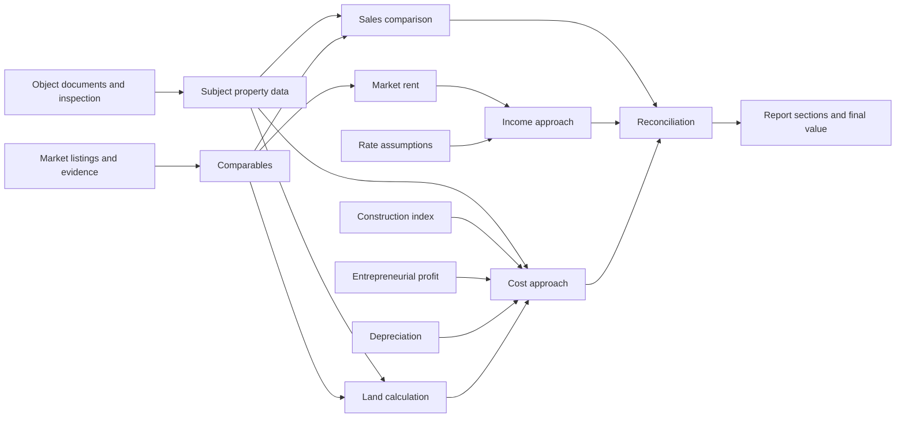

# Source Audit

## Audit Status

This audit records the structure and data flow visible in the supplied files.
It does not certify the report, formulas, coefficients, source data, or final
value. Methodological corrections require a separate review by an authorized
appraiser or methodologist.

## Source Inventory

| Source | Purpose | Observed structure |
| --- | --- | --- |
| Appraisal report (`.doc`) | Final customer-facing report | 578 paragraphs, 27 tables, 2 sections; converted to a temporary DOCX/PDF for read-only analysis |
| Calculation workbook (`.xlsx`) | Source data and linked valuation calculations | 11 worksheets covering three approaches, land, rent, depreciation, adjustments, rates, and reconciliation |
| Unified National Valuation Standard (`.pdf`) | Regulatory and methodological basis | 217 pages; includes NSO 1-14 and the real-estate methodology in Appendix 5 |

## Report Structure

The example report follows the main NSO 4 structure:

1. Title page and table of contents.
2. Cover letter.
3. Assignment, key facts, and conclusions.
4. Valuation sequence and applicable standards.
5. Limiting conditions, assumptions, terminology, and quality certificate.
6. Economic, regional, industry, and market analysis.
7. Description and identification of the subject property.
8. Selection and justification of approaches and methods.
9. Comparative, income, and cost approach calculations.
10. Reconciliation and final value conclusion.
11. Appendices and supporting documents.

The report contains both narrative sections and large calculation tables. The
largest tables represent comparative calculations, land valuation,
entrepreneurial profit, depreciation by building component, and reconciliation.

## Workbook Map

| Worksheet | Role | Main dependencies/results |
| --- | --- | --- |
| `к-т (2)` | Compound construction index | Produces the index used by the cost approach |
| `Затратный` | Cost approach by building/component | Uses construction index, entrepreneurial profit, depreciation, and land result |
| `Износ` | Physical depreciation by structural element | Produces depreciation percentages for each improvement |
| `Земля` | Land-use-right valuation | Uses comparable land offers and sequential adjustments |
| `Аренда` | Market rent calculation | Uses rental comparables and adjustment factors |
| `Доходный` | Income approach | Uses rent, occupancy, expenses, NOI, and capitalization rate |
| `Сравнител` | Sales comparison approach | Uses three comparables, sequential adjustments, weights, and subject area |
| `Итого` | Reconciliation and final outputs | Combines the three approaches and converts summary indicators |
| `расчет корректировок` | Supporting adjustment calculations | Calculates area, location, condition, and other adjustment factors |
| `ПП` | Entrepreneurial profit | Aggregates risk and profitability inputs |
| `Ставка` | Capitalization/discount rate | Aggregates risk premiums, capital recovery, and inflation adjustments |

### Calculation Flow

## Regulatory Requirements Converted Into Product Rules

| Standard area | Product consequence |
| --- | --- |
| NSO 2: valuation assignment | Required case fields for object, rights, customer, purpose, valuation date, value type, assumptions, users, and report format |
| NSO 3: research and analysis | Documented information collection, inspection, identification, photography, market analysis, and source provenance |
| NSO 4: valuation report | Required report sections, title-page data, source disclosure, attachments, signatures, and unambiguous presentation |
| NSO 6: approaches and methods | Method selection with justification, transparent inputs, adjustments, and reconciliation |
| NSO 7: internal quality control | Reviewer workflow, internal rules, traceable comments, and release controls |
| NSO 8: report examination | A reproducible evidence package for later examination |
| NSO 10 and Appendix 5 | Real-estate-specific object structure, highest and best use, at least three comparables, and approach-specific calculations |
| Retention requirements | Archive the report, source data, calculations, research, analysis, and every document used to reach the value |

## Observations Requiring Later Methodology Review

- The report and workbook contain different final and intermediate values.
- Some formulas contain broken references or rely on workbook behavior that
  must be checked in desktop Excel/ONLYOFFICE.
- Several coefficients and adjustments are entered manually without a
  machine-readable source or justification.
- Repeated narrative text is mixed with case-specific facts, making reuse and
  quality control difficult.
- Listing URLs can change or disappear; a dated evidence snapshot is required.
- Object, land, building, rent, and currency data are repeated in several
  places and can become inconsistent.
- The example is a complex property with a land parcel and multiple
  improvements, not a representative apartment case.

## Product Conclusions

- Structured case data must be the primary source for report fields.
- Every value needs provenance: user input, OCR, external source, formula, or
  approved AI proposal.
- Standard calculations should be native modules where stable; specialized
  models remain versioned XLSX workbooks edited through ONLYOFFICE.
- Report tables must be generated from calculation results instead of copied
  manually.
- Issued packages must be immutable snapshots even when the working case
  continues to change.
