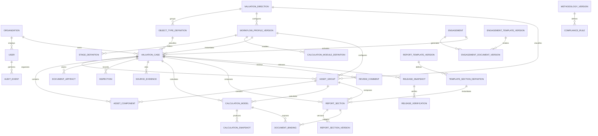

# Domain Model

## Aggregate Model

`ValuationCase` is the aggregate root. A case contains the assignment,
participants, subject property, supporting evidence, calculations, report
sections, review history, and release snapshots.



## Core Entities

| Entity | Responsibility |
| --- | --- |
| `Organization` | Company configuration, branding, report numbering, storage, and active methodology |
| `User` | Local account, profile, role, signature metadata, and activity |
| `ValuationDirection` | Real estate, equipment, motor vehicles, special machinery, business, intangible assets, or a future valuation vertical |
| `ObjectTypeDefinition` | Versioned object subtype and its required structured data |
| `WorkflowProfileVersion` | Immutable ordered workflow, transitions, screens, rules, modules, and compatible templates |
| `StageDefinition` | Shared or direction-specific stage with completion and blocking rules |
| `CalculationModuleDefinition` | Native or XLSX module enabled for a workflow profile |
| `Engagement` | Structured request, customer, scope, terms, price, dates, signatories, and approval state before valuation work |
| `EngagementTemplateVersion` | Immutable assignment, contract, or annex DOCX template with locked and editable clauses |
| `EngagementDocumentVersion` | Generated assignment/contract version with input snapshot, manual changes, hashes, approval, and signature state |
| `ValuationCase` | Assignment, selected direction/object/profile versions, purpose, dates, value type, status, deadline, appraiser, and reviewer |
| `AssetGroup` | Independent real-estate, equipment, vehicle, special-machinery, business, or intangible-asset scope inside one case |
| `AssetComponent` | Property, equipment, vehicle, legal entity, ownership interest, intangible right, or related component in one case |
| `DocumentArtifact` | Original, OCR result, generated report, workbook, photo, evidence snapshot, or signed file |
| `Inspection` | Visit date, participants, observations, measurements, condition, and photos |
| `SourceEvidence` | Source URL/file, access date, snapshot, extracted values, and confirmation |
| `Comparable` | Comparable object, transaction/offer data, characteristics, and adjustments |
| `CalculationModel` | Native calculation module or versioned XLSX workbook |
| `CalculationSnapshot` | Approved immutable inputs, formulas/model version, outputs, overrides, workbook hash, and recalculation state |
| `MethodologyVersion` | Approved collection of articles, formulas, references, and applicability rules |
| `ComplianceRule` | Blocking error or warning tied to a standard paragraph and case condition |
| `ReportTemplateVersion` | Immutable DOCX template definition with placeholders, loops, and conditional sections |
| `TemplateSectionDefinition` | Ordered report section, allowed content, applicability rule, and required bindings |
| `ReportSection` | Current structured content, template identity, citations, freshness, and approval state |
| `ReportSectionVersion` | Immutable manual or generated revision with author, origin, reason, and comparison base |
| `DocumentBinding` | Mapping from report content to a case field, calculation output, methodology article, or XLSX named range |
| `AIProposal` | Provider, prompt version, anonymized input hash, output, sources, and acceptance decision |
| `ReviewComment` | Reviewer remark attached to a field, calculation, section, or document |
| `ReleaseSnapshot` | Immutable issued DOCX/PDF/XLSX/evidence package with hashes and release number |
| `ReleaseVerification` | Public-safe QR identifier, release status, hash validation, and signature status |
| `AuditEvent` | Append-only record of material user and system actions |

## Valuation Composition

A single case may contain:

- one or more land parcels;
- one apartment or building;
- multiple buildings and structures;
- improvements, utilities, and site facilities;
- machines, production lines, vehicles, or inventory groups;
- one company, a group, an ownership interest, or a business unit;
- one or more brands, software products, patents, licenses, or related rights;
- related components included in or excluded from the valuation conclusion.

Components are organized into asset groups. Each group pins its own direction,
object type, workflow profile, calculations, report chapter, and approved
result. Shared engagement data remains at case level. A consolidation layer
creates either one unified report or separate reports without copying the
underlying data.

Each component uses the structured schema defined by its object type. Common
identity, rights, documents, evidence, provenance, and calculation
participation remain on the shared platform. Direction-specific characteristics
are provided by the pinned workflow profile.

## Roles

| Role | Main permissions |
| --- | --- |
| Director | Appraiser-level authority plus company-level final control; remains recorded as director in audit events |
| Appraiser | Create and accept cases, enter data, prepare materials, approve working artifacts, and perform final case approval |
| Assistant appraiser | Prepare working materials, draft artifacts, report sections, and assistant assignments before appraiser or director acceptance |

The director is not merged into the appraiser role. Assistant appraiser work
is explicitly preparatory: final artifact acceptance and final case approval
belong to an appraiser or director and are separately attributed.

## Lifecycle

```text
Draft -> In progress -> In review -> Returned -> Approved -> Issued -> Archived
```

- A case may move between `In review` and `Returned` multiple times.
- `Approved` means review is complete but the final files are not yet issued.
- `Issued` creates an immutable `ReleaseSnapshot`.
- A correction after issue creates another numbered release.

## Data Provenance Rules

- Every material field records origin, author, timestamp, and confirmation.
- OCR and AI outputs are proposals until explicitly confirmed.
- Formula outputs record the calculation model and model version.
- A source-data change marks affected report sections as stale but does not
  overwrite manual edits.
- A released report uses an approved calculation snapshot rather than a live
  workbook.
- XLSX releases retain the exact workbook used for the result.
- Market evidence retains URL, access date, local snapshot, and extracted data.
- Template, methodology, and compliance versions are frozen in every release.
- Audit history is append-only and cannot be edited through the application.

## Confidentiality Boundary

Customer data, addresses, photos, documents, workbooks, calculations, and
reports stay on company infrastructure. External AI receives only anonymized
text through a sanitization gateway. Backups leaving the company network are
encrypted before upload.
